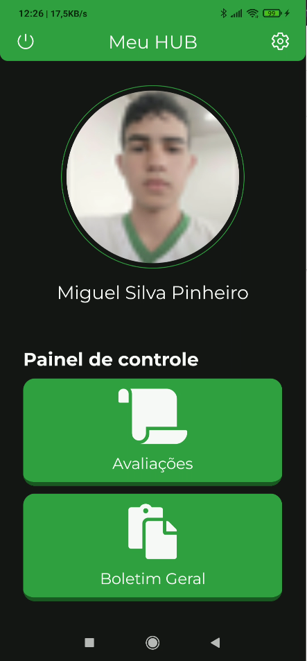

# MeuIFMG Mobile
<center>Um projeto desenvolvido com o intuito de facilitar e melhorar o acesso de notas/informações dos alunos de todos os Institutos Federais de Minas Gerais</center>


<br>
<div align="center">

[](https://www.youtube.com/watch?v=XvmD_Gankm4) 





</div>

# Instalação
Vá em [Releases](https://github.com/LearXD/MeuIFMG/releases) e baixe o APK mais recente do aplicativo.

# Compilação do APP
```bash
# Clone este repositório
$ git clone https://github.com/LearXD/MeuIFMG
$ cd MeuIFMG

# Instale as dependências
$ npm install

# Opções:
# Para compilar o app para android (versão de produção)
#APK
$ cd ./android && ./gradlew assembleRelease
# AAB
$ cd ./android && ./gradlew bundleRelease

# Para compilar o app para android (versão de debug)
$ npm run start
# Em outro terminal
$ npm run android
```

# Tecnologias Utilizadas

- [React Native](https://reactnative.dev/)
- [NodeJS](https://nodejs.org/en/)
- [React Navigation](https://reactnavigation.org/)
- [React Native Vector Icons](https://github.com/oblador/react-native-vector-icons)
- [React Native Reanimated](https://docs.swmansion.com/react-native-reanimated/)
- [React Native Gesture Handler](https://docs.swmansion.com/react-native-gesture-handler/)
- [Outras bibliotecas](./package.json)

# Creditos

Projeto de Pesquisa desenvolvido por:

| Nome                          | Função                  |
|-------------------------------|------------------------ |
| Miguel Silva Pinheiro         | Desenvolvedor Full Stack|
| Gustavo Rhemann Mendonça      | Designer UI/UX          |
| Arthur Caio Vargas e Pinto    | Orientador              |

Campus: IFMG - Campus Itabirito
